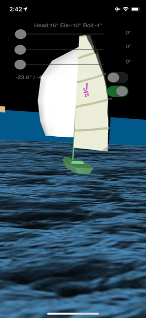

# BoatAttitude
This Delphi Firemonkey 3D sample app uses phone sensors to position a sailboat. 
It is a FiremonkeySensorFusion usage sample ( see /omarreis/FiremonkeySensorFusion )
Delphi's Gyro sample app tries to this, but does not quite get there. 

Compiled with D10.3.3 and tested on Android and iOS.

## FiremonkeySensorFusion

FiremonkeySensorFusion is a cross platform (Android and iOS) 
sensor fusion ( GPS + Accelerometer + Magnetometer )
The object receives sensor readings from the phone/tablet 
sensors and outputs phone attitude  in the form
of rectangular coordinates ( aka Euler angles ).

These are also known as Yaw,Pitch,Roll or Azimuth,elevation,roll or Heading,altitude,roll.

GPS reading is used to calculate the magnetic declination,
so we can obtain the true heading from the mag heading.

In this example we use the sensor readings to orient a 3D sailboat. 
Also included: sea surface, cardinal points ( N,S,E and W)
Sensor readings are used to rotate a camera pointing to
the boat.

## rotation quaternion
Firemonkey 3D uses TControl3D.RotationAngle to set object rotations. 
These are known as Euler angles. Using rotation angles in this way has a couple problems.
Setting Euler angles can lead to the so called "gymbal lock", with loss of freedom degree.
It is better to use quaternions to set object rotations.

Problem is Firemonkey TControl3D has no method to set the quaternion directly
or manipulating the 3d matrix.  This is worked around using a helper class
(this solution was copied from https://github.com/tothpaul/Delphi/blob/master/Google%20Cardboard/4%20FullDemo/Main.pas )

     type  // helper class to help manipulating the matrix instead of changing RotationAngle
       TControl3DHelper = class helper for TControl3D
         procedure SetMatrix(const M: TMatrix3D);
       end;

     procedure TControl3DHelper.SetMatrix(const M: TMatrix3D);
     begin
       FLocalMatrix := M;
       RecalcAbsolute;
       RebuildRenderingList;
       Repaint;
     end;

This allows manipulating the object 3d rotation matrix.

Check this tiktok video:

https://vm.tiktok.com/E2eQqP

